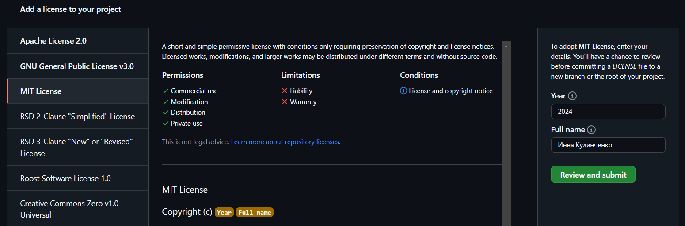
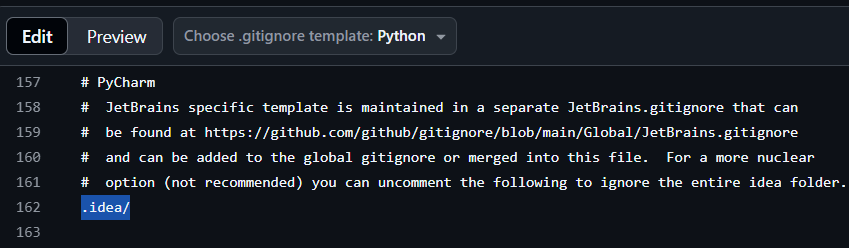
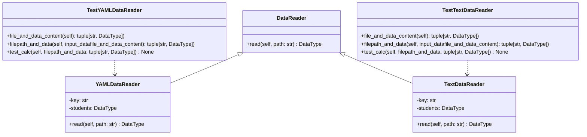
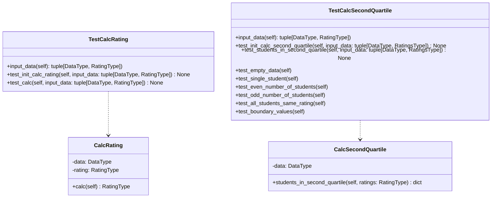

<h1 align="center">Лабораторная №1 по дисциплине "Технологии программирования"</h1>

## Знакомство с системой контроля версий Git и инструментом CI/CD GitHub Actions

### Цели работы:

1. Познакомиться c распределенной системой контроля версий кода Git и ее функциями;
2. Познакомиться с понятиями «непрерывная интеграция» (CI) и «непрерывное развертывание»
   (CD), определить их место в современной разработке программного обеспечения;
3. Получить навыки разработки ООП-программ и написания модульных тестов к ним на
   современных языках программирования;
4. Получить навыки работы с системой Git для хранения и управления версиями ПО;
5. Получить навыки управления автоматизированным тестированием программного обеспечения,
   расположенного в системе Git, с помощью инструмента GitHub Actions.

<h1 align="center">8 вариант</h1>

### Индивидуальное задание:

1. Необходимо было выбрать для данного проекта тип лицензии и добавить файл с лицензией в проект:

Была выбрана MIT License, позволяющая любому пользователю использовать, копировать, изменять и распространять
данное программное обеспечение



2. Далее добавляем в проект файл .gitignore и формируем его содержимое:




3. Добавляем в проект еще один класс – наследник класса DataReader, который должен
   обрабатывать входной файл определенного формата (в моем случае - YAML). Составляем модульные тесты для методов
   этого класса. Для работы с этим заданием создаём новую ветку кода на основе главной и фиксируем в нее весь
   программный код в процессе разработки. Добиваемся выполнения всех тестов проекта, после чего объединяем текущую ветку кода с главной. 

YAMLDataReader.py:
```python
from Types import DataType
from DataReader import DataReader
import yaml


class YAMLDataReader(DataReader):
    def __init__(self) -> None:
        self.key: str = ""
        self.students: DataType = {}

    def read(self, path: str) -> DataType:
        with open(path, encoding='utf-8') as file:
            yaml_data = yaml.safe_load(file)

        for item in yaml_data:
            for name, subjects in item.items():
                self.students[name] = [(subject, score)
                                       for subject, score in subjects.items()]

        return self.students
```


4. Добавляем в проект класс, реализующий расчет определенных характеристик студентов - Определить и вывести на экран всех студентов, чей рейтинг попадает во вторую квартиль распределения по рейтингам. 
    Составляем модульные тесты для методов этого класса. Для работы с этим заданием создаём новую ветку кода на основе главной и фиксируем в нее весь
    программный код в процессе разработки. Добиваемся выполнения всех тестов проекта, после чего объединяем текущую ветку кода с главной.

Для начала разберемся с понятием квартилей:
- Первый квартиль (Q1) — это значение, которое делит выборку на две части так, что 25% значений меньше Q1 и 75% значений больше Q1.
- Второй квартиль (Q2) — это значение, которое делит выборку на две части так, что 50% значений меньше или равны Q2 и 50% значений больше или равны Q2.
- Третий квартиль (Q3) — это значение, которое делит выборку на две части так, что 75% значений меньше Q3 и 25% значений больше Q3.


Далее пишем класс CalcSecondQuartile, который будет находить студентов, чей рейтинг попадает во вторую квартиль распределения по рейтингам.

CalcSecondQuartile.py:
```python
from Types import DataType
import numpy as np


class CalcSecondQuartile:
    def __init__(self, data: DataType):
        self.data = data

    def students_in_second_quartile(self, ratings):
        # Если нет рейтингов, то возвращаем пустой словарь
        if not ratings:
            return {}

        # Преобразуем значения рейтингов в список
        rating_values = list(ratings.values())

        # Получаем второй квартиль
        q1, q3 = np.percentile(rating_values, [25, 75])

        second_quartile_students = {}
        # Ищем студентов, чьи рейтинги попадают во второй квартиль
        for student, rating in ratings.items():
            if q1 <= rating <= q3:
                second_quartile_students[student] = rating

        return second_quartile_students

```

5. Составляем UML-диаграмму классов итогового проекта.

Используем для этого онлайн-редактор [Mermaid Live Editor](https://mermaid-js.github.io/mermaid-live-editor/)





6. Анализ полученных результатов и выводы:

Данная лабораторная работа позволила получить практический опыт в различных аспектах современной разработки: от работы с GitHub и написания кода до тестирования и документирования результатов.
